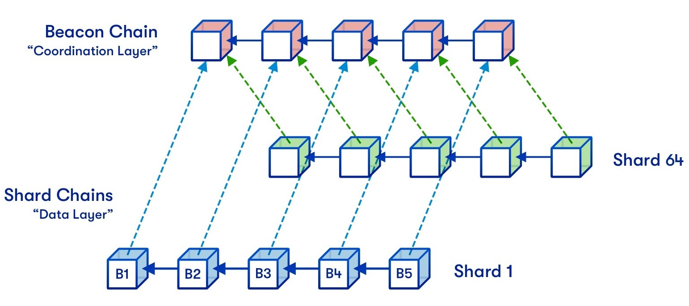

# How does Eth2 work?

_Contributed By: B. Vinoth Raj_  
_Dated: Jan 20, 2022_    
  
Eth2 introduces the concept of sharding, beacon chain, slots, epoch and crosslinks.

  

**Sharding**  
Sharding is a database partitioning technique for achieving horizontal scalability.
Using this technique the Ethereum network is split into several smaller chains called shards.
There will be 64 shard chains, with each having a shared understanding of the state of the network.
These 64 chains will run in parallel to another chain called as beacon chain.

**Beacon Chain**  
The Beacon Chain is the coordination mechanism of the new network, responsible for managing the validators, creating new blocks, making sure those new blocks are valid, and rewarding validators with ETH for keeping the network secure. The beacon chain receives state information from shards and makes it available for other shards.

**Validators**  
Shard chains need validators to process transactions and create new blocks. When you submit a transaction on a shard, a validator will be responsible for adding your transaction to a shard block. Validators are algorithmically chosen by the beacon chain to propose new blocks in both beacon chain and in shard chains. A validator not proposing a new block will attest to another validator's proposal. At least 128 validators are required to attest to each shard block – this is known as a "committee."

**Slots and Epoch**  
The committee has a timeframe to propose and validate a shard block. This is known as a "slot.". A slot can be regarded as block time. Only one valid block is created per slot. Each slot is 12 seconds and an epoch is 32 slots. Every 12 seconds, one beacon (chain) block and 64 shard blocks are added. After each epoch, the committee is disbanded and reformed with different, random participants.

**Crosslink**  
Once a new shard block proposal has enough attestations, a "crosslink" is created. A crosslink is a reference in a beacon block to a shard block. 

For more information read  
[The Beacon Chain Ethereum 2.0 explainer](https://ethos.dev/beacon-chain/)  
[Why Sharding is Great](https://vitalik.ca/general/2021/04/07/sharding.html)

[back](./)
